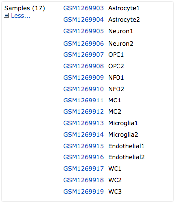

```{r setup, include = FALSE}
knitr::opts_chunk$set(
  collapse = TRUE,
  comment = "#>"
)
```

# Overview

ARCHS4 is a project ([web site][archs4web] | [publication][archs4pub])
lead by [Alex Lachmann][lachmann] from [The Ma'ayan Lab][maayanlab] which aims
to reprocesses all of the human and mouse Illumina based (RNA) sequencing data
from [GEO][geo] and [SRA][sra] and make it available for exploratory data
analysis.

To facilitate that, the raw sequencing data is processed through the same
quantitation pipeline, which consists of [kallisto][kallisto] for quantitation
and ensembl gene annotations for the transcript models. These data are then
made available:

1. as binary files [for download][archs4dl]; and
2. via an [interactive exploratory analysis tool][archs4eda].

The scope of this package, for now, is to simply make all of the gene- and
transcript-level expression data easily queryable and retrievable to an analyst
within R.

In this vignette, we show you how to install the `archs4` package and its
required data files as well as example usage scenarios.

# Installation

```{r child = "rmdparts/installation.Rmd"}
```

# Usage

Currently, the `archs4` package facilitates easy query and retrieval of the
samples that have been processed by the project.

After you have successfully:

1. installed the `archs4` R package;
2. downloaded and build the data dependencies into your `$ARCHS4DIR`; and
3. set the R `archs4.datadir` option to point to your `$ARCHS4DIR`, ie.
   `options("archs4.datadir" = "$ARCHS4DIR)")`

the use of this package will be most straightforward if you first instantiate a
reference object to the ARCHS4 data repository, like so:

```{r a4, warning=FALSE, message=FALSE}
library(archs4)
library(dplyr)
a4 <- Archs4Repository()
```

The `a4` object is what we will use to query and retrieve processed data from.
As of now, the archs4 repository contains 4000+ projects with 100,000+ samples
from both human and mouse experiments:

```{r show-a4}
show(a4)
```

## ARCHS4 Sample Queries

In order to retrieve expression data from the ARCHS4 `a4` object, you will need
to identify a GEO series id ("GSEnnnnn"), or GEO sample id ("GSMnnnnn") of
interest.

For instance, the RNA-seq expression data that was used for the
"[RNA-Sequencing Transcriptome and Splicing Database of Glia, Neurons, and Vascular Cells of the Cerebral Cortex][barrespub]" is accessible using the
[GSE52564 GEO series accession number][barresgeo]. When you click through to the
[GEO landing page][barresgeo] and scroll down, you will find a section of the
page that enumerates the samples in the series as shown in the picture below:



We can see that this GEO Series has seventeen (17) samples associated with it.

Let's query our ARCHS4 repository using the `sample_info()` function to see if
we have them. The `sample_info()` function accepts a character vector of
GEO identifiers (series, samples, or a mix of both) and queries the ARCHS4
repository to see if they are present in the dataset. The function will return
a `data.frame` where each row represents a single sample, and the columns
include different sample-level  metadata for the sample, which you can customize
via the `columns` argument:

```{r sample-query}
samples <- sample_info(a4, "GSE52564", columns = "Sample_title")
```

This function returns a `data.frame` with `r nrow(samples)` rows, which matches
the number of samples listed on this projects [GEO landing page][barresgeo].
Let's take a peak:

```{r sample-peak}
select(samples, sample_id, Sample_title)
```

Use the `sample_covaraites()` function to identify the names of all of the
sample-level metadata variables that are available from the mouse and human
datasets:

```{r scov-available}
sample_covariates(a4) %>% head()
```

Any combination of the entries listed in the `name` column of the `data.frame`
above can be used in the `columns` parameter of the `sample_info()` function.
Although most of these covariates are available in both human and mouse, not
all of them are. The `mouse` and `human` column indicate which covariates are
found in which datasets.

## Expression Data

The `archs4` package provides an `as.DGEList` function, which will accept a
vector of series or sample identifiers and materialize a gene- or
transcript-level `edgeR::DGEList` that they correspond to.

For instance, to create a gene-level `DGEList` for this project, we would:

```{r}
yg <- as.DGEList(a4, "GSE52564", feature_type = "gene")
```

This call returns a `r nrow(yg)` (gene) x `r ncol(yg)` (sample) DGEList that you
can then easily feed into a downstream differential expression analysis pipeline
such as edgeR or voom.

Setting `feature_type = "transcript"` in the `as.DGEList` call will give you a
DGEList with transcript-level quantitation.

Any combination of GEO Series and GEO Sample identifiers will work in this
function call so long as they all reference data generated from the same
organism.

## Missing Samples

In your course of using this data resource, you might find that your query for
a particular GEO Series identifier will return fewer samples than are enumerated
on its landing page. There are a number of reasons why individual samples did
not make it into the ARCHS4 dataset.

Some missing data is due to errors in the ARCHS4 data processing pipeline, where
they may have encountered problems downloading raw data or irregularities in 
processing (aligning) it. There are also more mundane reasons, such as a single
GEO Series identifier may contain both RNA-seq and microarray data, the latter
of which would not be included in ARCHS4 resource.

The `series_status()` function will tell you if there are  missing samples
from a GEO Series.

```{r}
s1 <- series_status(a4, "GSE52564")
head(s1)
```

A `TRUE` value in the `in_archs4` column indicates that the sample is present
in the ARCHS4 repository.

In this particular case, we can verify that all samples in the `"GSE52564"`
series are found in the ARCHS4 dataset, ie. `all(s1$in_archs4) == TRUE`

Other GEO Series, however, are not complete. For instance,
[GEO Series GSE89189][blurtongeo] should contain 43 samples, however there
are a few (six) that are missing:

```{r}
series_status(a4, "GSE89189") %>% 
  filter(!in_archs4)
```

When we use functions like `sample_info()` or `as.DGEList` which expand
GEO Series-level identifiers into the samples they contain, the default
behavior is to call the `series_status()` function internally to check whether
all of the samples for a GEO Series are present in the ARCHS4 dataset. If not,
the user will be warned:

```{r}
y2 <- as.DGEList(a4, "GSE89189", feature_type = "gene")
```

**NOTE:** The `series_status()` function makes a call to an NCBI web-service to
query the samples for a given series, and therefore (i) requires an active
internet connection; and (ii) may take *a little* time to complete.

# Conclusion

The `archs4` package provides a convenient way to quickly access the vast
amount of data made available by the [ARCHS4 Project][archs4web]. The package
will evolve over time to suit the needs of analysts who work with this great
resource via their R workspace.

While we, the authors of this package, are big fans the
[ARCHS4 Project][archs4web], please note that this package is not affiliated
with, nor endorsed by the creators of ARCHS4. As such, any issues, bugs, or
comments should be directed towards the authors of this package, or filed under
its issue tracker:

https://github.com/denalitherapeutics/archs4/issues


[//]: # (References ===========================================================)
```{r child = "rmdparts/references.Rmd"}
```
